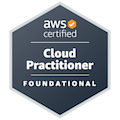
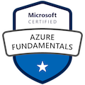
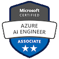

## Ermogenes Palacio ☕
- Software Engineer @ https://portal.prodam.sp.gov.br/
- _Curriculum_ Specialist @ https://www.cps.sp.gov.br/
- Teacher @ http://eteab.com.br/

Senior Software Engineer and Teacher in Professional and Superior Education with 20y+ experience. Dev since childhood.

  

<!-- - Microsoft Certified: [⭐ Azure Fundamentals](https://www.youracclaim.com/badges/6380b971-e8f4-4757-a4ab-4cc1a52f95f3/public_url) [⭐⭐ Azure AI Engineer Associate](https://www.youracclaim.com/badges/61de0d9e-076e-42f9-87fc-118897772d79/public_url)
- AWS Certified: [⭐ Cloud Practitioner](https://www.credly.com/badges/659c34d2-eb45-461d-bf01-a8f0bd29bacc/public_url) -->

---

🔭 Dev C# & Dev Web: side projects with free content for portuguese speakers learning to code

 
